# I DREAM A NEW CALENDAR — Module Dolibarr

Module de remplacement du calendrier natif de [Dolibarr ERP CRM](https://www.dolibarr.org) basé sur la bibliothèque [EventCalendar](https://github.com/vkurko/calendar). Il remplace les vues Mois/Semaine/Jour de l'agenda natif par un calendrier interactif unique avec gestion de sources externes ICS, filtres avancés, édition et création rapide des événements.

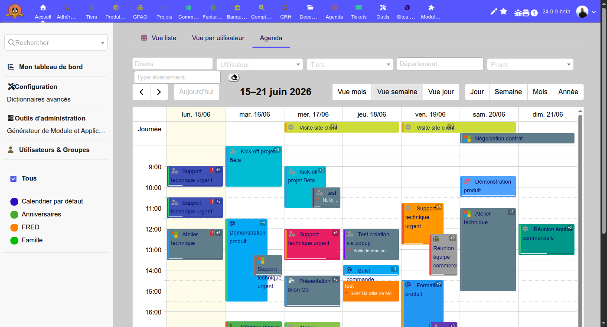

---

## Sommaire

- [Prérequis](#prérequis)
- [Installation](#installation)
- [Configuration](#configuration)
  - [Paramètres généraux](#paramètres-généraux)
  - [Calendriers externes (admin)](#calendriers-externes-admin)
  - [Calendriers externes (par utilisateur)](#calendriers-externes-par-utilisateur)
- [Fonctionnalités](#fonctionnalités)
  - [Vue calendrier](#vue-calendrier)
  - [Vue liste](#vue-liste)
  - [Indicateurs visuels](#indicateurs-visuels)
  - [Couleur des événements](#couleur-des-événements)
  - [Filtres et recherche](#filtres-et-recherche)
  - [Masquage des calendriers](#masquage-des-calendriers)
  - [Création rapide par sélection de plage](#création-rapide-par-sélection-de-plage)
  - [Édition rapide par popup](#édition-rapide-par-popup)
  - [Glisser-déposer et redimensionnement](#glisser-déposer-et-redimensionnement)
  - [Anniversaires](#anniversaires)
  - [Calendriers ICS externes](#calendriers-ics-externes)
  - [Actualisation automatique](#actualisation-automatique)
- [Architecture technique](#architecture-technique)
  - [Structure des fichiers](#structure-des-fichiers)
  - [Descripteur de module](#descripteur-de-module)
  - [Classe de hooks](#classe-de-hooks)
  - [Triggers](#triggers)
  - [Base de données](#base-de-données)
  - [API AJAX](#api-ajax)
- [Permissions](#permissions)
- [Internationalisation](#internationalisation)
- [Bibliothèques tierces](#bibliothèques-tierces)
- [Licence](#licence)

---

## Prérequis

| Dépendance | Version minimale |
|---|---|
| PHP | 7.4 |
| Dolibarr | 20.0 |
| Module **Agenda** | activé |

**Incompatibilité :** Ce module ne peut pas coexister avec le module **fullcalendar** (`modfullcalendar`). L'un doit être désactivé avant d'activer l'autre.

---

## Installation

### Depuis le fichier ZIP (interface graphique)

1. Téléchargez le ZIP du module (`module_idreamanewcalendar-x.y.z.zip`).
2. Dans Dolibarr, allez dans **Accueil → Configuration → Modules → Déployer un module externe**.
3. Uploadez le fichier ZIP.
4. Activez le module dans la liste des modules (famille **Projets**).

### Depuis un dépôt Git

```bash
cd /var/www/dolibarr/htdocs/custom
git clone https://github.com/frederic34/dolibarr_module_idreamanewcalendar.git idreamanewcalendar
```

Ensuite, activez le module dans **Accueil → Configuration → Modules**.

### Vérification post-installation

À l'activation, le module :
- Crée la table SQL `llx_actioncomm_deleted`.
- Crée le répertoire de données `DOL_DATA_ROOT/idreamanewcalendar/temp/`.
- Remplace les onglets natifs de l'agenda (Mois, Semaine, Jour) par un onglet unique **Agenda**.
- Remplace l'onglet **Sites externes** de la fiche utilisateur par sa propre version.

---

## Configuration

Accédez à la configuration via **Accueil → Configuration → Modules → IDreamANewCalendar → Configurer**.

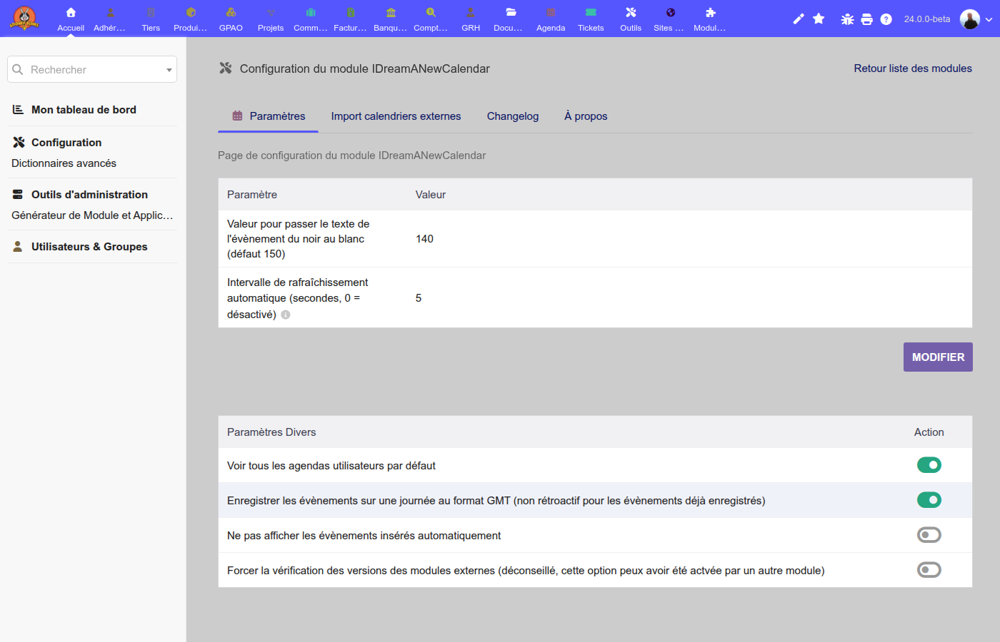

### Paramètres généraux

| Constante | Type | Description | Défaut |
|---|---|---|---|
| `IDREAMANEWCALENDAR_LIGTHNESS_SWAP` | Entier (0–255) | Seuil de luminosité en dessous duquel le texte des événements passe en blanc (sur fond sombre). | 155 |
| `IDREAMANEWCALENDAR_REFRESH_INTERVAL` | Entier (secondes) | Intervalle d'actualisation automatique du calendrier. Mettre `0` pour désactiver. | 300 |
| `AGENDA_ALL_CALENDARS` | Booléen | Affiche par défaut les événements de tous les utilisateurs (pas uniquement de l'utilisateur connecté). | Off |
| `MAIN_STORE_FULL_EVENT_IN_GMT` | Booléen | Enregistre les événements toute la journée en format GMT (non rétroactif). | Off |
| `IDREAMANEWCALENDAR_DONT_SHOW_AUTO_EVENTS` | Booléen | Masque les événements générés automatiquement (type `AC_OTH_AUTO`). | Off |

### Calendriers externes (admin)

Onglet **Sites externes** de la configuration admin. Permet de définir jusqu'à `AGENDA_EXT_NB` (défaut : 6) flux ICS globaux, visibles par tous les utilisateurs.

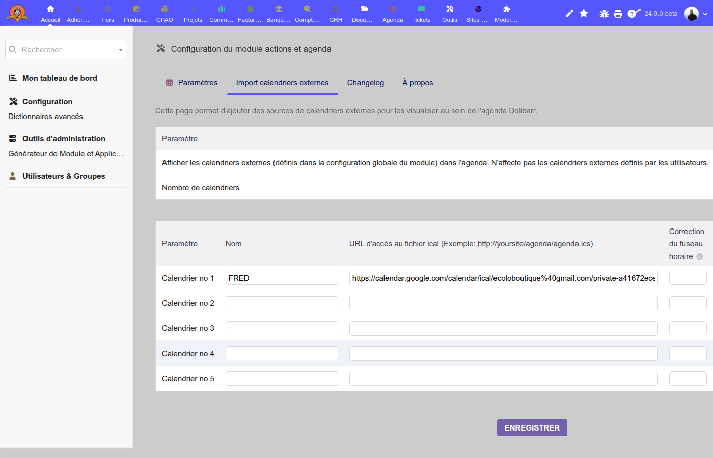

| Champ | Constante | Description |
|---|---|---|
| Nom | `AGENDA_EXT_NAME{i}` | Nom affiché dans la liste des calendriers |
| URL | `AGENDA_EXT_SRC{i}` | URL du flux ICS |
| Décalage horaire | `AGENDA_EXT_OFFSETTZ{i}` | Décalage en heures par rapport à l'heure du serveur |
| Couleur | `AGENDA_EXT_COLOR{i}` | Code couleur hexadécimal |
| Activé | `AGENDA_EXT_ENABLED{i}` | Activer/désactiver ce flux |
| Cache | `AGENDA_EXT_CACHE{i}` | Durée du cache en secondes (défaut : 1800 s) |
| Actif par défaut | `AGENDA_EXT_ACTIVEBYDEFAULT{i}` | Affiché par défaut dans la vue calendrier |
| Désactiver tout | `AGENDA_DISABLE_EXT` | Désactive tous les flux externes globalement |

### Calendriers externes (par utilisateur)

Chaque utilisateur peut définir ses propres flux ICS via l'onglet **Calendriers externes** de sa fiche utilisateur.

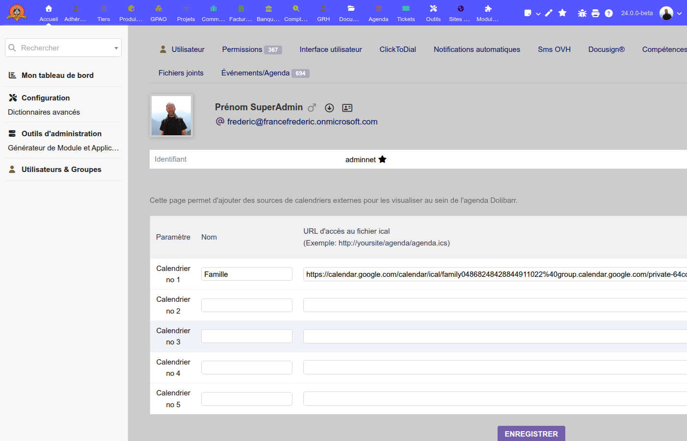

Les constantes sont stockées par utilisateur avec le pattern `AGENDA_EXT_{FIELD}_{uid}_{i}`.

| Champ | Description |
|---|---|
| Nom | Nom affiché |
| URL | URL du flux ICS |
| Décalage horaire | Décalage en heures |
| Couleur | Code couleur hexadécimal |
| Activé | Activer/désactiver |
| Cache | Durée du cache (défaut : 3600 s) |

---

## Fonctionnalités

### Vue calendrier

Le module remplace les trois onglets natifs de l'agenda (Mois, Semaine, Jour) par un onglet unique propulsé par la bibliothèque **EventCalendar**. Huit vues sont disponibles, réparties en deux groupes dans la barre d'outils :

**Vues grille**

| Vue | Description |
|---|---|
| Mois | Grille mensuelle |
| Semaine | Grille hebdomadaire avec créneaux horaires (08h–22h) |
| Jour | Grille journalière |

**Vues liste**

| Vue | Description |
|---|---|
| Jour | Liste des événements du jour |
| Semaine | Liste des événements de la semaine |
| Mois | Liste des événements du mois |
| Année | Liste des événements de l'année |

La vue par défaut est contrôlée par la préférence utilisateur `AGENDA_DEFAULT_VIEW`. Le premier jour de la semaine est configurable via `MAIN_START_WEEK` (défaut : 1 = lundi).

Le label **Journée** (all-day) est traduit dans la langue de l'utilisateur.

**Vue semaine**


**Vue mois**

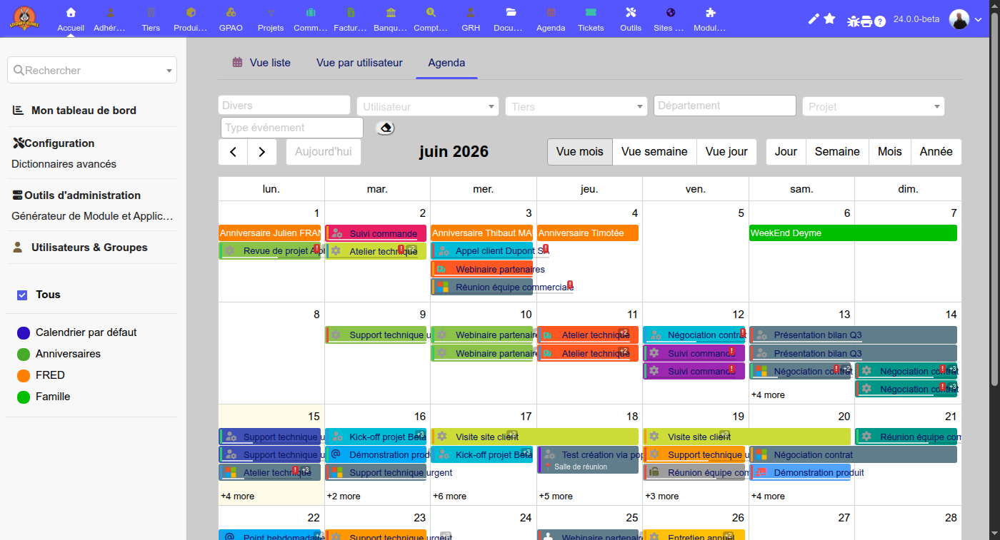

**Vue jour**

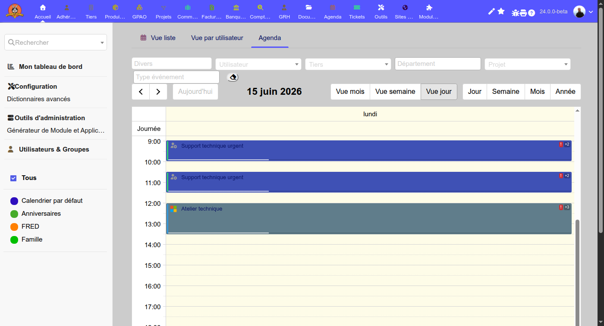

### Vue liste

Les vues liste affichent les événements sous forme de tableau chronologique, avec titre, horaire et couleur du type d'événement. Pratique pour avoir un aperçu rapide sur une longue période.

**Vue liste mois**

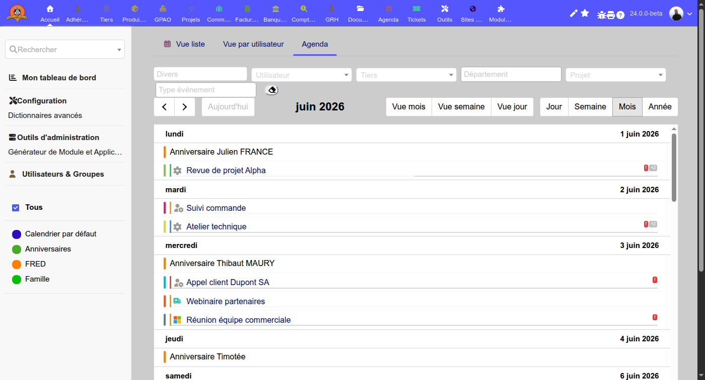

### Indicateurs visuels

Chaque bloc d'événement dans le calendrier affiche jusqu'à quatre indicateurs superposés :

| Indicateur | Position | Condition |
|---|---|---|
| Barre de progression | Bas de l'événement (2 px) | `percentage >= 0` |
| Badge retard `!` (rouge) | Coin supérieur droit | `percentage < 100` et date de fin dépassée |
| Badge objets liés `⛓` | Coin supérieur droit | L'événement a des objets liés (facture, commande, etc.) |
| Badge participants `+N` | Coin supérieur droit | Plus d'un participant assigné |

La barre de progression est blanche semi-transparente et proportionnelle au pourcentage d'avancement. Les badges sont superposés en rangée horizontale au coin droit.

### Couleur des événements

La couleur de fond de chaque événement correspond à son **type d'action**. L'ordre de priorité est le suivant :

1. Couleur définie dans **Accueil → Configuration → Dictionnaires → Types d'action** (champ couleur de l'admin Dolibarr).
2. Si aucune couleur n'est définie, une **palette de repli** intégrée est utilisée :

| Type | Couleur |
|---|---|
| `AC_TEL` | `#4CAF50` (vert) |
| `AC_FAX` | `#9E9E9E` (gris) |
| `AC_PROP` | `#FF9800` (orange) |
| `AC_EMAIL` | `#2196F3` (bleu) |
| `AC_RDV` | `#F44336` (rouge) |
| `AC_EMAIL_IN` | `#03A9F4` (bleu clair) |
| `AC_COM` | `#9C27B0` (violet) |
| `AC_FAC` | `#FFC107` (ambre) |
| `AC_SHIP` | `#009688` (teal) |
| `AC_INT` | `#FF5722` (orange foncé) |
| `AC_OTH` | `#607D8B` (gris bleu) |
| *(autres)* | `#607D8B` (gris bleu) |

La couleur du texte (noir ou blanc) est calculée automatiquement d'après la luminosité HSL de la couleur de fond, via le seuil `IDREAMANEWCALENDAR_LIGTHNESS_SWAP`.

En plus de la couleur de fond, chaque événement affiche une **fine bordure gauche colorée** avec la couleur personnelle de l'utilisateur propriétaire (champ *couleur* de la fiche utilisateur Dolibarr).

### Filtres et recherche

Un panneau de filtres est affiché au-dessus du calendrier. Tous les selects de filtrage ont une largeur uniforme (200 px).

| Filtre | Type | Condition |
|---|---|---|
| Recherche libre | Texte | Recherche dans le sujet, les notes et le lieu |
| Utilisateur | Select2 (défilement infini) | Requiert `agenda.allactions.read` |
| Tiers | Select2 (défilement infini) | Requiert le module **Sociétés** et `societe.lire` |
| Département | Multi-sélection Select2 | Départements français (France) |
| Projet | Select2 (défilement infini) | Requiert le module **Projets** et `projet.lire` |
| Type d'action | Multi-sélection Select2 | Types d'action configurés dans le dictionnaire |

Les selects Tiers et Projets chargent les résultats page par page (20 par page) sans minimum de caractères requis — la liste s'ouvre immédiatement au clic. Un bouton réinitialiser (gomme) remet tous les filtres à zéro.

### Masquage des calendriers

Chaque calendrier affiché dans le panneau gauche peut être masqué ou réaffiché individuellement en cliquant sur sa case à cocher. La case **Tous** permet de tout masquer ou tout réafficher d'un coup.

Le masquage est instantané (injection CSS `display:none` sur les éléments portant la classe `ec-cal-{id}`) — aucun rechargement des données n'est nécessaire.

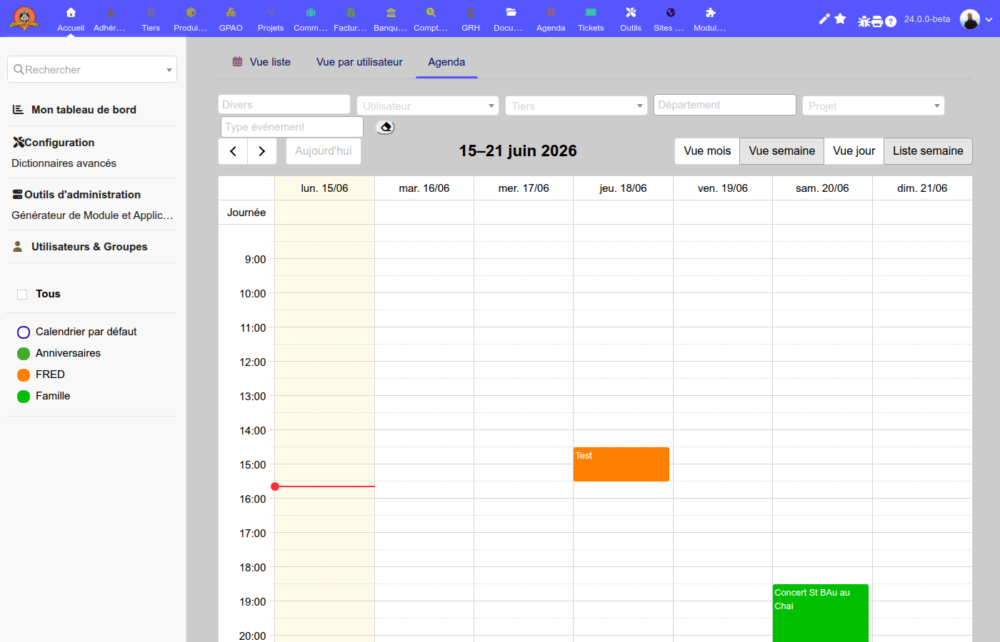

### Création rapide par sélection de plage

Cliquer-glisser sur une plage horaire de la grille ouvre un dialogue de création avec la date et l'heure pré-remplies.

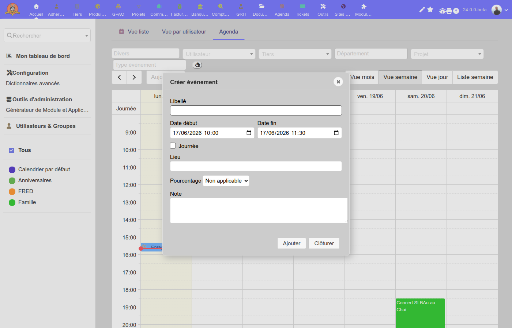

| Champ | Description |
|---|---|
| Libellé | Sujet de l'événement |
| Date début / Date fin | Pré-remplies d'après la sélection |
| Journée | Case à cocher pour un événement toute la journée |
| Lieu | Adresse ou salle |
| Pourcentage | Avancement |
| Note | Note privée |

Boutons : **Ajouter** (POST `createaction`), **Clôturer**.

### Édition rapide par popup

Un clic sur un événement existant ouvre une fenêtre de dialogue jQuery UI.

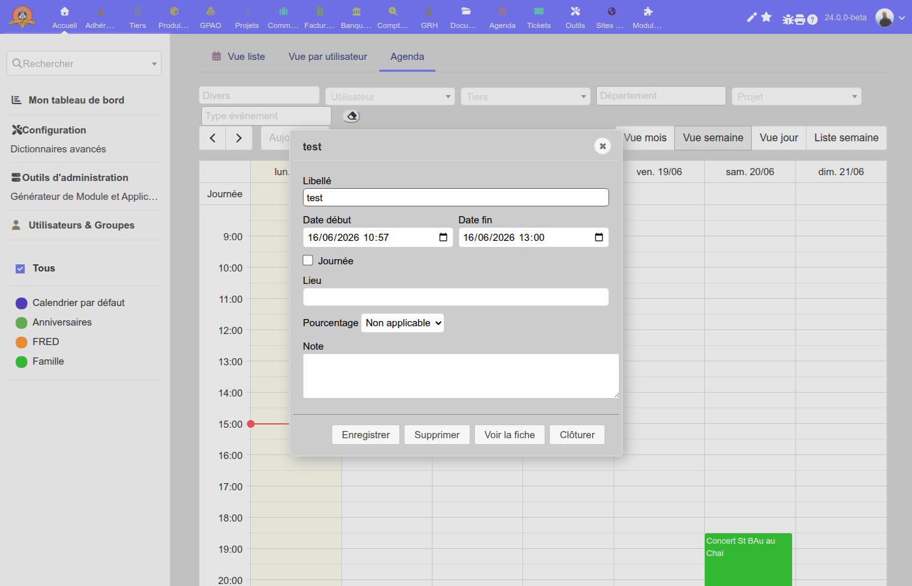

**Événement éditable** (appartenant à l'utilisateur connecté ou `agenda.allactions.create`) :

| Champ | Description |
|---|---|
| Libellé | Sujet de l'événement |
| Date début / Date fin | Champs `datetime-local` (ou `date` si journée entière) |
| Journée | Case à cocher — bascule les champs entre date et datetime |
| Lieu | Adresse ou salle |
| Pourcentage | Avancement (Non applicable, 0 %, 25 %, 50 %, 75 %, 100 %) |
| Note | Note privée — éditée via **CKEditor** (si disponible) avec barre d'outils réduite : gras, italique, souligné, listes, lien, source HTML. Affichage brut `<textarea>` si CKEditor absent. |

Boutons disponibles : **Enregistrer** (AJAX `updateaction`), **Supprimer** (AJAX `deleteevent`), **Voir la fiche** (ouvre la fiche Dolibarr dans un nouvel onglet), **Clôturer**.

**Événement en lecture seule** (ICS externe, anniversaire, événement auto, autre propriétaire) : affiche un dialogue d'information non modifiable avec la description complète de l'événement (HTML ou texte ICS), et un seul bouton **Clôturer**.

### Glisser-déposer et redimensionnement

Les événements Dolibarr éditables peuvent être :
- **Déplacés** par glisser-déposer → mise à jour des dates de début et de fin.
- **Redimensionnés** par drag sur le bord inférieur → mise à jour de la date de fin.

Ces modifications sont répercutées immédiatement via l'API AJAX (`action=putevent`). Les événements en lecture seule (ICS, anniversaires, type `AC_OTH_AUTO`) ne peuvent pas être déplacés ni redimensionnés — toute tentative est annulée automatiquement.

### Anniversaires

Les anniversaires des contacts (champ `birthday` de `llx_socpeople`) sont affichés comme événements toute la journée, non modifiables. Seuls les contacts publics ou créés par l'utilisateur connecté sont affichés.

### Calendriers ICS externes

Les flux ICS (globaux et personnels) sont chargés via l'API AJAX et analysés avec la bibliothèque **ics-parser**. Les données sont mises en cache sur disque sous forme de fichier `.ics` brut dans `DOL_DATA_ROOT/agenda/temp/` :

- Flux globaux : `ical-e{entity}-{calendarId}.ics` (durée configurable par flux, défaut 30 min).
- Flux personnels : `ical-e{entity}-u{uid}-{calendarId}.ics` (défaut 60 min).

Tous les flux (Dolibarr, anniversaires, ICS) sont récupérés en parallèle via `Promise.all` et fournis au widget en un seul appel `successCallback`, ce qui évite tout scintillement à l'actualisation.

La liste des calendriers disponibles est affichée dans le panneau latéral gauche. Chaque calendrier peut être affiché ou masqué indépendamment via des cases à cocher.

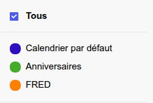

### Actualisation automatique

Le calendrier s'actualise automatiquement à l'intervalle défini par `IDREAMANEWCALENDAR_REFRESH_INTERVAL` (défaut : 300 secondes). Mettre cette valeur à `0` désactive l'actualisation automatique.

À chaque actualisation, le client interroge également `action=getdeletedevents` pour supprimer de la vue les événements supprimés depuis la dernière actualisation.

---

## Architecture technique

### Structure des fichiers

```
idreamanewcalendar/
├── admin/
│   ├── setup.php               — Page de configuration principale
│   ├── agenda_extsites.php     — Gestion des flux ICS globaux (admin)
│   ├── changelog.php           — Affichage du changelog avec émojis
│   └── about.php               — Page À propos
├── class/
│   └── actions_idreamanewcalendar.class.php  — Classe de hooks
├── core/
│   ├── ajax/
│   │   └── ajax_events.php     — Endpoint JSON de l'API
│   ├── modules/
│   │   └── modIDreamANewCalendar.class.php   — Descripteur de module
│   └── triggers/
│       └── interface_99_modIDreamANewCalendar_IDreamANewCalendarTriggers.class.php
├── css/
│   └── idreamanewcalendar.css.php            — Feuille de style (PHP dynamique)
├── langs/
│   ├── en_US/idreamanewcalendar.lang
│   ├── fr_FR/idreamanewcalendar.lang
│   ├── de_DE/idreamanewcalendar.lang
│   ├── es_ES/idreamanewcalendar.lang
│   ├── it_IT/idreamanewcalendar.lang
│   └── uk_UA/idreamanewcalendar.lang
├── lib/
│   ├── event-calendar/         — Bibliothèque JS EventCalendar v5
│   ├── ics-parser/             — Parser ICS (ICal\ICal)
│   └── idreamanewcalendar.lib.php  — Préparation des onglets admin
├── sql/
│   └── llx_actioncomm_deleted.sql
├── tabs/
│   └── agenda_extsites.php     — Onglet flux ICS utilisateur
├── config.php                  — Bootstrap Dolibarr
└── ChangeLog.md
```

### Descripteur de module

**Fichier :** `core/modules/modIDreamANewCalendar.class.php`  
**Classe :** `modIDreamANewCalendar extends DolibarrModules`

| Propriété | Valeur |
|---|---|
| ID de module (`numero`) | `14011966` |
| Famille | `projects` |
| PHP minimum | 7.4 |
| Dolibarr minimum | 20.0 |
| Icône | `action` (calendrier natif Dolibarr) |
| Auteur | frederic34 |

**Hooks enregistrés :**
- `actioncard` — fiche d'événement
- `agenda` — page principale de l'agenda
- `leftblock` — bloc de gauche (panneau des calendriers)

**Onglets supprimés de l'agenda natif :** `cardmonth`, `cardweek`, `cardday`

**Onglet ajouté à l'agenda :**
- Clé : `idreamanewcalendar` — Label : **Agenda** — URL : `/comm/action/index.php`

**Onglet remplacé sur la fiche utilisateur :**
- Supprime l'onglet natif `extsites` et le remplace par `/idreamanewcalendar/tabs/agenda_extsites.php`

### Classe de hooks

**Fichier :** `class/actions_idreamanewcalendar.class.php`  
**Classe :** `ActionsIDreamANewCalendar`

| Méthode | Contexte | Description |
|---|---|---|
| `beforeAgenda()` | `agenda` | **Hook principal.** Remplace intégralement la page d'agenda natif en injectant le calendrier EventCalendar, la barre de filtres et les sources d'événements. Appelle `exit` après rendu. |
| `printLeftBlock()` | `leftblock` | Injecte le panneau latéral `#lnb-calendars` avec la liste des calendriers (coché/décoché). Actif uniquement sur `index.php`. |
| `doActions()` | `actioncard`, `agenda` | Placeholder pour futures actions POST — retourne 0. |
| `getPrintActionsFilter()` | *privée* | Génère le HTML du formulaire de filtres (commenté dans le hook). |
| `formSelectStatusAction()` | *privée* | Widget `<select>` de filtrage par statut de complétion. |

Le hook `beforeAgenda` :
1. Charge les en-têtes HTML via `llxHeader()` avec EventCalendar JS/CSS et Select2.
2. Lit les paramètres de filtre depuis `$parameters` (utilisateur, tiers, projet, type, etc.).
3. Calcule les flux ICS globaux et personnels activés.
4. Génère la barre de filtres avec selects Select2 à défilement infini (utilisateurs, tiers, projets) et multi-selects (départements, types d'action).
5. Monte l'instance `EventCalendar` en JavaScript avec une source d'événements unifiée :
   - Tous les appels AJAX (Dolibarr, anniversaires, ICS) sont lancés en parallèle via `Promise.all`.
   - `successCallback` n'est appelé qu'une seule fois avec le résultat fusionné, sans scintillement.
6. Configure le drag-and-drop et le redimensionnement avec protection des événements en lecture seule.
7. Configure le popup d'édition jQuery UI via `ec.setOption('eventClick', ...)`.
8. Configure le popup de création via `ec.setOption('select', ...)` : sélection d'une plage horaire ouvre un dialogue pré-rempli.
9. Configure l'auto-refresh via `setInterval`.

### Triggers

**Fichier :** `core/triggers/interface_99_modIDreamANewCalendar_IDreamANewCalendarTriggers.class.php`  
**Classe :** `InterfaceIDreamANewCalendarTriggers extends DolibarrTriggers`

| Événement Dolibarr | Méthode déclenchée | Action |
|---|---|---|
| `ACTION_DELETE` | `actionDelete()` | Insère l'ID supprimé dans `llx_actioncomm_deleted` et purge les entrées de plus de 24 heures. |
| Tous les autres | *(ignoré)* | Aucune action. |

Ce mécanisme permet au frontend de détecter et retirer les événements supprimés entre deux actualisations.

### Base de données

#### Table `llx_actioncomm_deleted`

```sql
CREATE TABLE llx_actioncomm_deleted(
    rowid         INTEGER AUTO_INCREMENT PRIMARY KEY,
    tms           TIMESTAMP ON UPDATE CURRENT_TIMESTAMP NOT NULL DEFAULT CURRENT_TIMESTAMP,
    fk_actioncomm INTEGER NOT NULL
) ENGINE=innodb;
```

| Colonne | Description |
|---|---|
| `rowid` | Identifiant auto-incrémenté |
| `tms` | Horodatage de la suppression (mis à jour automatiquement) |
| `fk_actioncomm` | ID de l'événement supprimé dans `llx_actioncomm` |

**Rétention :** Les entrées de plus de 24 h sont purgées à chaque déclenchement du trigger. L'API AJAX retourne uniquement les suppressions des 3 dernières heures.

### API AJAX

**Fichier :** `core/ajax/ajax_events.php`  
**Type de réponse :** `application/json`  
**Authentification :** Session Dolibarr (NOCSRFCHECK activé)

#### Actions disponibles

| `action` | Méthode | Description |
|---|---|---|
| `getevents` | GET | Retourne les événements pour une plage de dates. Paramètre clé : `resourceId`, `start`, `end`, et filtres optionnels. |
| `getdeletedevents` | GET | Retourne les IDs des événements supprimés depuis moins de 3 h. |
| `getaction` | GET | Retourne les détails complets d'un événement Dolibarr pour le popup d'édition (paramètre `id`). |
| `putevent` | POST | Met à jour les dates et le lieu d'un événement (drag-and-drop / resize). |
| `createaction` | POST | Crée un nouvel événement `AC_OTH` depuis le popup de création (libellé, dates, lieu, note, pourcentage). |
| `updateaction` | POST | Met à jour les champs d'un événement depuis le popup d'édition (libellé, dates, lieu, note, pourcentage). |
| `postevent` | POST | Crée un nouvel événement de type `AC_OTH`. |
| `deleteevent` | POST | Supprime un événement. |
| `getcalendars` | GET | Retourne la liste de tous les calendriers disponibles (Dolibarr, anniversaires, ICS). |
| `getcustomers` | GET | Liste paginée des tiers (paramètres `q`, `page`). 20 résultats par page. |
| `getprojects` | GET | Liste paginée des projets (paramètres `q`, `page`). 20 résultats par page. |
| `getdolusers` | GET | Autocomplete utilisateurs Dolibarr (paramètre `q`). |
| `gettypeactions` | GET | Retourne tous les types d'action actifs du dictionnaire. |
| `getstates` | GET | Retourne les départements français. |
| `getconfig` | GET | Stub — retourne `{}`. |
| `getdolgroups` | GET | Stub — retourne `[]`. |
| `getresources` | GET | Stub — retourne `[]`. |

#### Format de retour `getevents`

Chaque événement retourné est un objet JSON compatible EventCalendar v5 :

```json
{
  "id": 42,
  "resourceId": "1",
  "title": "<a href='...'>Réunion client</a>",
  "body": "Note interne",
  "start": "2026-06-15T09:00:00+02:00",
  "end": "2026-06-15T10:00:00+02:00",
  "startEditable": true,
  "durationEditable": true,
  "allDay": false,
  "textColor": "#ffffff",
  "backgroundColor": "#2e0ebe",
  "extendedProps": {
    "location": "Paris",
    "attendees": ["<span>...</span>"],
    "borderColor": "#e87e04",
    "percent": 50,
    "hasLinkedObjects": true
  }
}
```

Les événements en lecture seule (ICS, anniversaires, `AC_OTH_AUTO`) ont `startEditable: false` et `durationEditable: false`.

#### Format de retour `getaction`

```json
{
  "id": 42,
  "label": "Réunion client",
  "note": "Ordre du jour...",
  "percent": 0,
  "location": "Paris",
  "fulldayevent": false,
  "start": "2026-06-15T09:00",
  "end": "2026-06-15T10:00",
  "startEditable": true
}
```

#### Format de retour `getcustomers` / `getprojects`

Format Select2 avec pagination :

```json
{
  "results": [
    { "id": 1, "text": "Société Exemple" }
  ],
  "pagination": { "more": true }
}
```

#### Logique de couleur du texte

La fonction `isDarkColor()` calcule la luminosité HSL de la couleur de fond. Si elle est inférieure à `IDREAMANEWCALENDAR_LIGTHNESS_SWAP` (défaut 155), le texte est blanc (`#ffffff`), sinon noir (`#000000`).

#### Sources d'événements par `resourceId`

| `resourceId` | Source | Éditable |
|---|---|---|
| `1` | Événements `llx_actioncomm` | Oui (si propriétaire ou `agenda.allactions.create`) |
| `2` | Anniversaires `llx_socpeople.birthday` | Non |
| `> 2` | Flux ICS externe identifié par `calendarName` | Non |

---

## Permissions

| Permission | Clé | Activée par défaut |
|---|---|---|
| Lire les événements | `$user->rights->idreamanewcalendar->read` | Oui |
| Créer/modifier les événements | `$user->rights->idreamanewcalendar->write` | Non |
| Supprimer les événements | `$user->rights->idreamanewcalendar->delete` | Non |

**Remarque :** Ces permissions sont propres au module. L'accès effectif aux événements Dolibarr est contrôlé par les permissions `agenda.*` natives.

---

## Internationalisation

Les fichiers de langue sont dans `langs/{locale}/idreamanewcalendar.lang`.

| Locale | Statut |
|---|---|
| `fr_FR` | Référence |
| `en_US` | Traduit |
| `de_DE` | Traduit (automatique) |
| `es_ES` | Traduit (automatique) |
| `it_IT` | Traduit (automatique) |
| `uk_UA` | Traduit (novembre 2025) |

Pour ajouter une langue, créez le répertoire `langs/{locale}/` et copiez `en_US/idreamanewcalendar.lang` en traduisant les valeurs.

---

## Bibliothèques tierces

| Bibliothèque | Chemin | Usage |
|---|---|---|
| [EventCalendar v5](https://github.com/vkurko/calendar) | `lib/event-calendar/` | Widget calendrier principal (JS + CSS) |
| [ics-parser](https://github.com/u01jmg3/ics-parser) | `lib/ics-parser/` | Parsing des flux ICS externes (PHP) |
| [Select2](https://select2.org) | fourni par Dolibarr | Selects à défilement infini pour les filtres |
| jQuery UI | fourni par Dolibarr | Dialog pour le popup d'édition |

---

## Licence

**Code source :** GPLv3 ou ultérieure. Voir le fichier `COPYING`.  
**Documentation :** GFDL.  
**Auteur :** Frédéric FRANCE ([@frederic34](https://github.com/frederic34))
